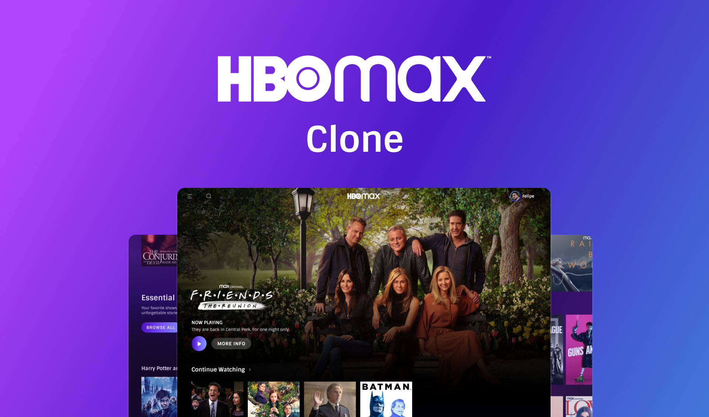

# :rocket: NLW Return :rocket:

<div align="center">
    
</div>

---
## :art: Layout
[Figma](https://www.figma.com/community/file/1102912516166573468)

---
## :gear: Techs
- [ReactJS](https://reactjs.org/)
- [Vite](https://vitejs.dev/)
- [TailwindCSS](https://tailwindcss.com/)
- [Axios](https://axios-http.com)
- [React Native](https://reactnative.dev/)
- [Expo](https://expo.dev/)
- [NodeJS](https://nodejs.org)
- [Jest](https://jestjs.io/)
- [Prisma](https://www.prisma.io/)
- [Insomnia](https://insomnia.rest/)

---
## :rocket: Lições do evento
- Desenvolvimento com acessibilidade
    - Navegação por teclado
- Qualidade de código
    - Evitando práticas ruins de desenvolvimento
- Uso do Typescript
    - Intefaces, Types para facilitar a busca de propriedades navegadas na aplicação

---
## :iphone: Ambientes :computer: 
<h3 align="center">Web</h3>


<h3 align="center">Mobile</h3>


---
## :desktop_computer: Como usar
- No Backend e no FrontEnd, basta abrir suas respectivas pastas (server ou feedget) e rodar o comando no terminal:
```
    yarn dev
```

- Abrir uma aba no navegador e digitar localhost:3000 no caso do FronteEnd e no Backend basta buscar na rota http://localhost:3333/feedbacks

- No Mobile, basta rodar no terminal:
```
    expo start
```
ou 
```
    yarn start
```
- Logo depois basta escanear o QR code caso utilize o Expo Go [Expo Go](https://expo.dev/client) com o proprio smartphone, ou utilizar o [Android Studio](https://developer.android.com/studio) e teclar A no terminal, para abrir no Android, quando o Emulador estiver aberto. 
---
## :books: License
Arquivos sob a licença [MIT](https://github.com/lucasgomesgp) criado por Lucas Gomes.